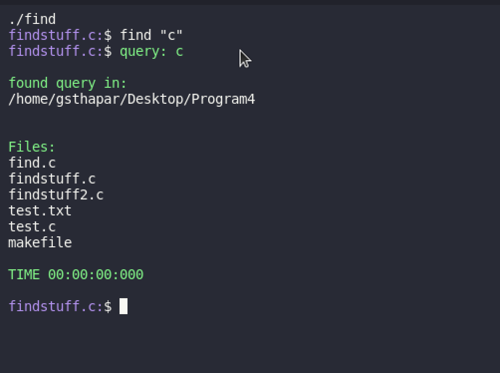
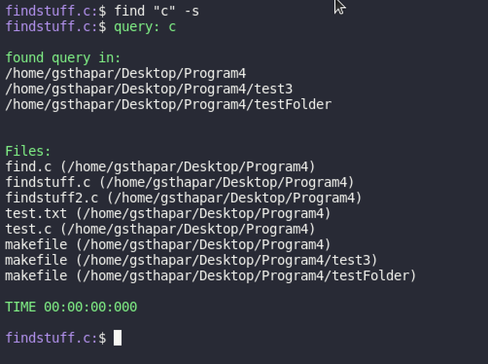
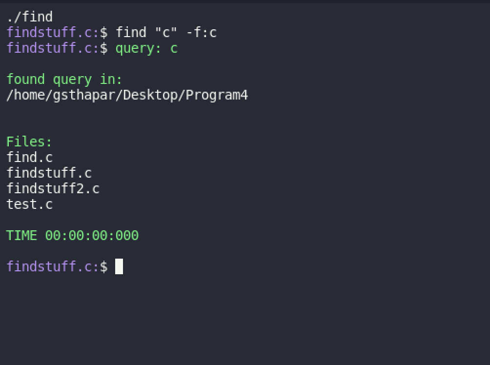
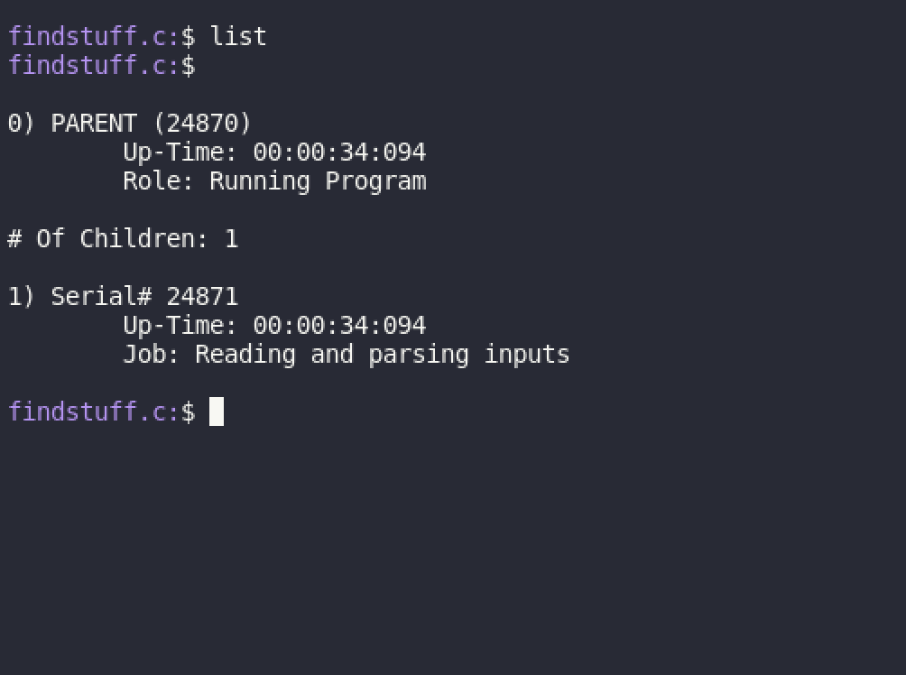

# **MyGREP**: custom string and file finder
Based on LINUX's GREP function, this is a program written for my Systems Programming class to mimic its functions (with some modifications).

<p align="center">
  
</p>

<div align="center">(Image from JavaRevisited)</div><br>

## **Program Specifications**
The objective of the project was to recreate GREP in C using a Linux-based environment; Ubuntu in this case. The program took a little under a week to write and test and received a 100% score.

The program, however, should not recreate GREP exactly. In particular, MyGrep should have a few functions such as `list`, `kill`, `q`, and `find` which list children processes, kill specific children processes, quit the program, and find certain search queries. The program should also incorporate a couple flags, namely `-s` to search subdirectories and `-f` to only search specific files. A complete list of use cases can be found in **Usage**. The program should also record the time it took to find all results.

On top of the required functions, the program should utlize pipes, signals, shared memory, and redirects to accomplish the task. A few screenshots of the program running can be found below.

## **Glamor Shots**

<p align="center">
  
</p>

<div align="center">Figure 1. Opening Screen of MyGrep</div><br>

<p align="center">
  
</p>

<div align="center">Figure 2. Find file function. Looking for all files named "find" in the current directory.</div><br>

<p align="center">
  
</p>

<div align="center">Figure 3. Find string function. Looking for "c" in all files in the current directory.</div><br>

<p align="center">
  
</p>

<div align="center">Figure 4. Find string function. Looking for "c" in all files in the current directory and all subdirectories</div><br>

<p align="center">
  
</p>

<div align="center">Figure 5. Find string function. Looking for "c" in all files in the current directory with the .c extension</div><br>

<p align="center">
  
</p>

<div align="center">Figure 6. Example of a query returning no search results.</div><br>

<p align="center">
  
</p>

<div align="center">Figure 7. List children function.</div><br>

<p align="center">
  
</p>

<div align="center">Figure 8. Quit program function.</div><br>


## **Usage**
> **NOTE:** MyGrep was written on an Ubuntu VM and, as a result, may not work for all platforms especially non-UNIX ones (i.e., Windows).

To use MyGrep, you can download the repository and run the ```make``` command to compile the system, clear the console, and run the executable. 

> **NOTE:** The only file that gets compiled is ```findstuff.c```. All other ```.c``` files are used to test the program and see its capabilities (as shown below).

MyGrep has a few commands (as alluded to in **Program Specifications**):<br>
- ```list``` will list out all processes used to find the query (with a max of 10 children allowed plus 1 parent process). The list function includes the process number, PID, and up-time.
- ```q``` will quit the program
- ```kill # ``` will kill the child whose process number is ```#```
- ```find file``` will search the current directory for the file whose name (and not necessarily the extension) match
- ```find "string"``` will search all files in the current directory for the specifed string. The difference between the find file and find string functions are the use of quotation marks around the string
- ```find FILE/STRING -s``` will search the current *and all subdirectories* for the specified file/string
- ```find FILE/STRING -f:x``` will search all files *with the extension following the ```-f:``` flag* for the specified file/string. For example, if a `.c` file is the query but the `-f:` flag is set to search for text files, i.e., `-f:txt`, the query will return 0 results.
> **NOTE:** The `-f:` and `-s` flags can be stacked to search the current *and all subdirectories* for the specfied file/string with the specified extension.
